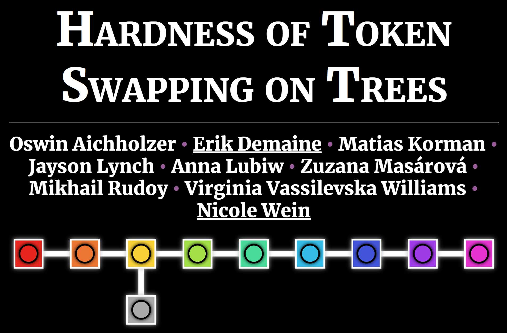

# Talk: Token Swapping on Trees

This repository contains slides and animations for a talk about our 2021 paper
"[Hardness of Token Swapping on Trees](https://arxiv.org/abs/2103.06707)"
by Oswin Aichholzer, Erik Demaine, Matias Korman, Jayson Lynch, Anna Lubiw,
Zuzana Mas, Mikhail Rudoy, Virginia Vassilevska Williams, and Nicole Wein.
See the paper for more details about the results.

## [View Slides](https://edemaine.github.io/talk-token-swapping-in-trees/)

[](https://edemaine.github.io/talk-token-swapping-in-trees/)

## Technology

This repository serves as a demo of an approach to making slides
by combining the following technology (all free and open source):

* [RevealJS](https://revealjs.com/): a flexible HTML presentation framework,
  extendable by plugins and themes.  Here we use:
  * [Chalkboard](https://github.com/rajgoel/reveal.js-plugins/tree/master/chalkboard):
    enables live drawing annotation on the slides (using pen or touch or mouse)
  * [Merriweather](https://fonts.google.com/specimen/Merriweather) font
* [Pug](https://pugjs.org/): a concise indentation-based notation for HTML,
  which makes it easier to express RevealJS slides,
  and to mix together other languages.  Here we use:
  * [Stylus](https://stylus-lang.com/): a concise indentation-based notation
    for CSS (styling of HTML)
  * [CoffeeScript](https://coffeescript.org/): an indentation-based language
    that compiles to JavaScript
* [KaTeX](https://katex.org): a library for translating LaTeX math into HTML
* [SVG.js](https://svgdotjs.github.io/):
  a library that makes it easy to add animations to SVG drawings
* [Gulp](https://gulpjs.com/): a tool that builds the Pug code into HTML

## Structure

Here's an overview of the individual files and what they do:

* [`gulpfile.coffee`](gulpfile.coffee): Definitions of `build` and `watch`
  rules that run Pug on `index.pug`.
* [`index.pug`](index.pug): Top-level Pug file that calls all other files.
  Defines the top-level structure of the document, but has no slides.
* [`slides.pug`](slides.pug): Slides and specific animations are defined here.
* [`tokenswap.coffee`](tokenswap.coffee): SVG.js-based code to implement
  token-swapping animations, enabling `slides.pug` to define a triggerable
  animation sequence on a slide with a single line:
  ```pug
  .tokenswap.fragment(data-swaps="4,3 4,2 4,1 3,2 3,1 2,1")
  ```
* [`index.styl`](index.styl): Some custom RevealJS styling,
  and specific SVG styling for the figures and animations.
  (Check out the cool glow/shadow effects!)
* [`cayley4.png`](cayley4.png): [Image from Wikimedia Commons](https://commons.wikimedia.org/wiki/File:Symmetric_group_4;_Cayley_graph_1,2,6_(1-based).png), licensed under CC-BY-SA

## Build Instructions

To build the slides HTML (`index.html`) from the source files:

1. Install [NodeJS](https://nodejs.org/) if you haven't already.
2. Clone the repository
3. Run the following:

   ```sh
   npm install
   npm run build
   ```

If you're live-editing the file and want `index.html` to continually build
and update, use the following command:

```sh
npm run watch
```

To assemble just the needed files into a `dist` directory,
use the following command:

```sh
npm run dist
```

To deploy these files to GitHub Pages, use the following command:

```sh
npm run deploy
```
